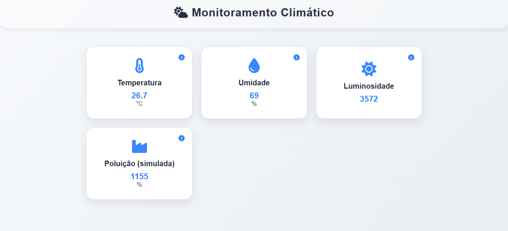

# Monitoramento Ambiental em Tempo Real com ESP32 e FreeRTOS

Este projeto foi desenvolvido por [**JoaquimLG**](https://github.com/JoaquimLG) e [**Valter Leite**](https://github.com/Valter-LeiteJr), e implementa um sistema de **monitoramento climático** utilizando o microcontrolador **ESP32** e sensores de baixo custo.  
O sistema utiliza **FreeRTOS** para um gerenciamento de tarefas robusto e concorrente.

Os dados coletados (**temperatura**, **umidade**, **luminosidade** e **poluição simulada**) são exibidos em **tempo real** em uma **página web** hospedada pelo próprio ESP32 e também podem ser consultados remotamente via **Telegram**.  
O projeto oferece duas opções de conectividade Wi-Fi: **Modo Ponto de Acesso (AP)** ou **Modo Estação (STA)**.

---

## Funcionalidades

### Arquitetura de Software
- **Multitarefa com FreeRTOS:** O sistema é baseado em FreeRTOS, dividindo as principais funções em tarefas concorrentes:
  - Task para leitura dos sensores  
  - Task para o gerenciamento do servidor web (responsivo a conexões)  
  - Task para o controle lógico dos LEDs de alerta
  - **Task dedicada ao Bot do Telegram** (monitoramento e comandos remotos)

- **Sincronização Segura:** Utilização de **Mutex (do FreeRTOS)** para proteger o acesso às variáveis globais (dados dos sensores), evitando **condições de corrida (race conditions)** entre as tarefas do servidor web e do bot.

---

## Conectividade

- **Modo Duplo de Wi-Fi:**
  - **Modo Ponto de Acesso (AP):** O ESP32 cria sua própria rede Wi-Fi, permitindo o acesso direto ao dispositivo.  
  - **Modo Estação (STA):** O ESP32 se conecta a uma rede Wi-Fi local existente (ex: Wi-Fi de casa), facilitando o acesso por qualquer dispositivo na mesma rede.

- **Integração com Telegram:**
  - O sistema se conecta à API do Telegram para receber comandos e enviar o status dos sensores diretamente para o chat do usuário.

---

## Funções Principais

- Leitura de **temperatura e umidade** com o sensor **DHT11** - Medição de **luminosidade** com um **LDR** - **Simulação da qualidade do ar** utilizando um **potenciômetro** - Exibição em uma **interface web interativa** - **LED vermelho** pisca em situações críticas (*temperatura > 30 °C ou umidade < 40%*)  
- **LED amarelo** indica níveis de luminosidade acima do limite configurado  
- **Atualização dinâmica** da página web (via *fetch JavaScript*) sem precisar recarregar
- **Comando `/get` no Telegram:** Envia um relatório instantâneo com os valores formatados idênticos ao monitor serial.

---

## Configuração do Telegram

Para utilizar a funcionalidade de monitoramento via chat, é **necessário** configurar o Bot antes de carregar o código:

1.  Crie um novo bot através do **@BotFather** no Telegram.
2.  Obtenha o **Token de Acesso** gerado.
3.  Insira este Token no arquivo de configuração (`Config.h`) do projeto.

> **Obs:** Sem a criação do bot e a inserção do Token correto, a funcionalidade de chat não estará disponível, mas o restante do sistema (Web e LEDs) continuará funcionando normalmente.

---

## Hardware Utilizado

- ESP32  
- Protoboard  
- Jumpers  
- LEDs sinalizadores  
- Resistores  
- Sensor **DHT11** (temperatura e umidade)  
- **LDR** (luminosidade)  
- **Potenciômetro** (simulação de poluição)

---

## Software Utilizado

- **PlatformIO** integrado ao **VS Code** - **FreeRTOS** (nativo do ESP32/Arduino Core)  
- **Biblioteca DHT sensor library** - **Bibliotecas UniversalTelegramBot e ArduinoJson**
- **Bibliotecas WiFi e WebServer** (nativas do ESP32)  
- **Navegador web** para exibição dos dados  

---

## Circuito

O sistema foi montado em uma **protoboard**, interligando o **ESP32**, os **sensores** e os **LEDs de alerta**.

---

## Resultados

- O sistema funcionou de forma **estável e responsiva**, com a task do servidor web e do Telegram respondendo a requisições, enquanto as outras tasks de sensores e LEDs operavam em paralelo.  
- A implementação do **FreeRTOS** eliminou a necessidade de `delay()` bloqueantes no loop principal, resultando em um código **mais limpo e eficiente**.  
- A flexibilidade entre os modos **AP e STA** permite que o projeto seja facilmente integrado a redes domésticas ou usado de forma independente.  
- Os **LEDs atuaram corretamente** em condições críticas, **sem travar** as demais funções do sistema.